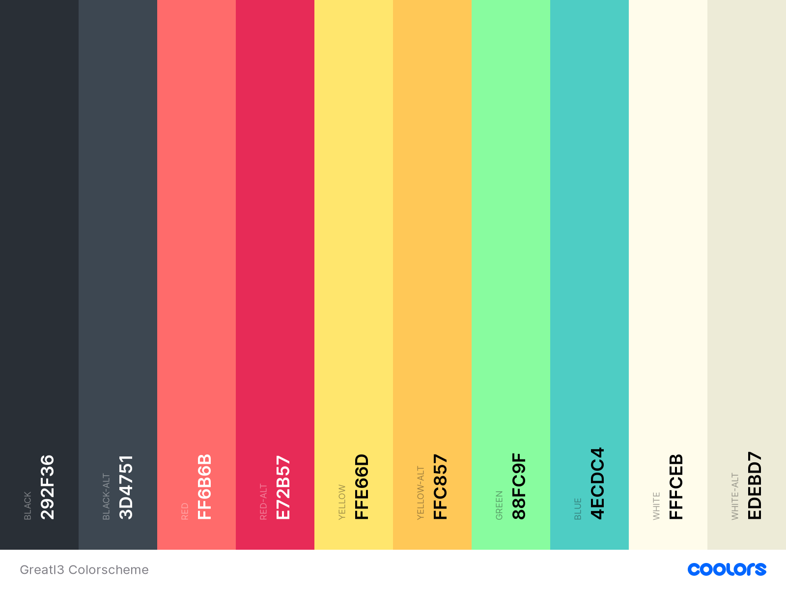

# GreatI3 - Рабочий стол, который будет делать вашу работу легче
GreatI3 - проект, который я сделал просто потому что я работаю на большом количестве ПК. Мне нужен был один рабочий стол, который бы подходил под мои требования.
Я решил сделать такой для себя из уже созданного софта (писать свой было бы долго и сложно). Далее идут диаграмы, которые показывают с каким софтом данный рабочий стол будет работать. Этот стек мой основной.

При установке данного софта, скорее всего вся конфигурация у вас будет работать стабильно, однако если это не так, то добро пожаловать на [issues](https://github.com/us3rn4m3-profile/GreatI3/issues)

### Дополнительно
*Шрифты*:
* [Iosevka](https://github.com/be5invis/Iosevka)
* [FontAwesome](https://fontawesome.com/)

*Гиф*: 
* [Treefall Gif](https://github.com/loki7990/Tranquility/blob/master/.config/bspwm/treefall.gif)

*Цветовая палитра*:


# Установка
Для того, чтобы установить GreatI3 на Arch Linux, вам нужно выполнить следующий скрипт:
```bash
sudo pacman -Sy --noconfirm i3 i3-gaps base-devel rofi dolphin moc okular feh vim code picom kitty ranger git
git clone https://github.com/us3rn4me-profile/GreatI3.git
cd GreatI3
mkdir -p $HOME/.local/share/fonts/ && \
cp fonts/* $HOME/.local/share/fonts/ && \
fc-cache -vf
cp ./config/* $HOME/.config/ -r && sudo cp ./40-libinput.conf /usr/share/X11/xorg.conf.d/40-libinput.conf
cp ./scripts $HOME/.scripts -r

# Build Polybar

# Build XWinWrap
sudo pacman -Sy --noconfirm xorg-dev build-essential libx11-dev x11proto-xext-dev libxrender-dev libxext-dev gifsicle
git clone https://github.com/ujjwal96/xwinwrap.git $HOME/gitinstalled/xwinwrap
cd xwinwrap
make
sudo make install
make clean
cd ../
rm -rf xwinwrap
```

## Потребление RAM
Я старался сделать данную сборку наиболее минималистичной, так что добавлял только самые нужные и важные программы в автозапуск. Мне удалось добится высокой энергоэффективности и малого потребления RAM.

## Горячие клавиши
Я пытаюсь сделать GreatI3 удобным для всех, поэтому горячие клавиши работают по определённым правилам


## Топбар
Так как в i3 по умолчанию топбар слабенький, то я воспользовался аналогом на Python - [Polybar](https://github.com/polybar/polybar). Его конфигурация лежит в `$HOME/.config/polybar/{config,modules}`


