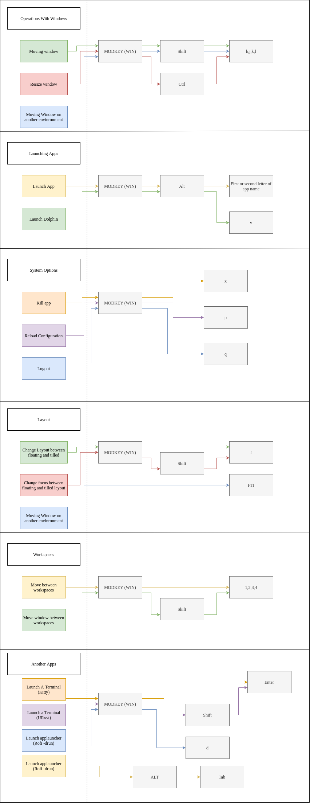

# GreatI3 - Рабочий стол, который будет делать вашу работу легче
GreatI3 - проект, который я сделал просто потому что я работаю на большом количестве ПК. Мне нужен был один рабочий стол, который бы подходил под мои требования.
Я решил сделать такой для себя из уже созданного софта (писать свой было бы долго и сложно). Далее идут диаграмы, которые показывают с каким софтом данный рабочий стол будет работать. Этот стек мой основной.

При установке данного софта, скорее всего вся конфигурация у вас будет работать стабильно, однако если это не так, то добро пожаловать на [issues](https://github.com/us3rn4m3-profile/GreatI3/issues)

## Горячие клавиши
Я пытаюсь сделать GreatI3 удобным для всех, поэтому горячие клавиши работают по определённым правилам

