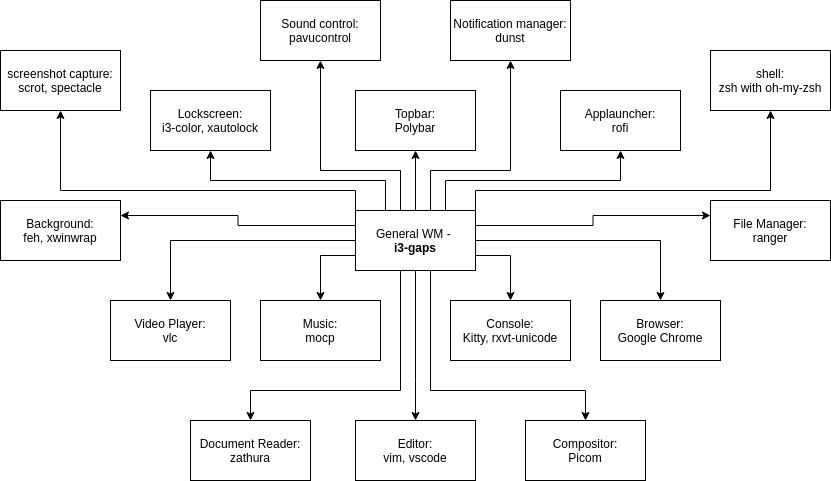
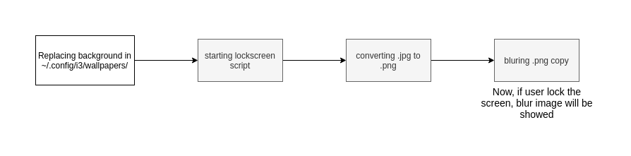
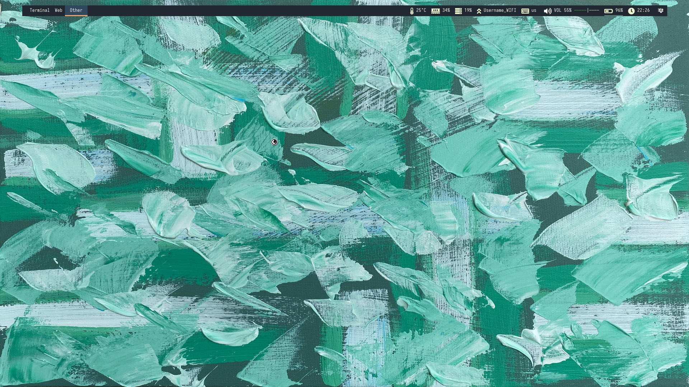
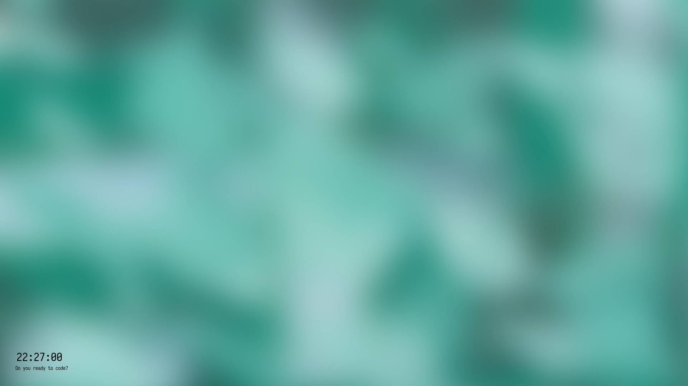

<div align="center">
  
</div>

<p align="center"><strong>GreatI3 - Рабочий стол, который будет делать вашу работу легче</strong></p>

GreatI3 - проект, который я сделал просто потому что я работаю на большом количестве ПК. Мне нужен был один рабочий стол, который бы подходил под мои требования.
Я решил сделать такой для себя из уже созданного софта (писать свой было бы долго и сложно). Далее идут диаграмы, которые показывают с каким софтом данный рабочий стол будет работать. Этот стек мой основной.

При установке данного софта, скорее всего вся конфигурация у вас будет работать стабильно, однако если это не так, то добро пожаловать на [issues](https://github.com/us3rn4m3-profile/GreatI3/issues)


*Шрифты*:
* [Iosevka](https://github.com/be5invis/Iosevka)
* [FontAwesome](https://fontawesome.com/)

*Гиф*: 
* [Treefall Gif](https://github.com/loki7990/Tranquility/blob/master/.config/bspwm/treefall.gif)

*Цветовая палитра*:


Для того, чтобы установить GreatI3 на Arch Linux, вам нужно выполнить следующий скрипт:
```bash
# Installing Packages
sudo pacman -Sy --noconfirm i3 i3-gaps base-devel rofi okular feh vim code picom kitty ranger git xdotool xautolock i3lock-color scrot imagemagick rxvt-unicode urxvt-perls
# Cloning repository
git clone https://github.com/us3rn4me-profile/GreatI3.git
# Changing directory
cd GreatI3
# Copying main configs for urxvt and zsh
cp zshrc $HOME/.zshrc
cp Xresources $HOME/.Xresources
# Copying fonts
mkdir -p $HOME/.local/share/fonts/ && \
cp fonts/* $HOME/.local/share/fonts/ && \
fc-cache -vf
# Copying config for touchpad
cp ./config/* $HOME/.config/ -r && sudo cp ./40-libinput.conf /usr/share/X11/xorg.conf.d/40-libinput.conf
# Copying scripts
cp ./scripts/* $HOME/.config/i3/ -r

# Build Polybar

# Build XWinWrap
sudo pacman -Sy --noconfirm xorg-dev build-essential libx11-dev x11proto-xext-dev libxrender-dev libxext-dev gifsicle
git clone https://github.com/ujjwal96/xwinwrap.git $HOME/gitinstalled/xwinwrap
cd xwinwrap
make
sudo make install
make clean
cd ../
rm -rf xwinwrap
```
| Пакет | Для чего нужен |
---------|-----------------
| xwinwrap | Нужен для установки файлов с расширением .gif в виде анимированных обоев |
| polybar | Нужен для того, чтобы в менеджере окон отображался топбар |
| i3 | Сам оконный менеджер |
| i3-gaps | Расширение для оконного менеджера |
| base-devel | Компоненты необходимые для установки polybar |
| rofi | Программа для запуска приложений |
| okular | Программа для просмотра документов |
| zathura | Программа для просмотра документов (поддерживает не так много расширений, однако более минималистичная) |
| feh | Программа для просмотра картинок, а также для установки фоновых изображений |
| vim | Основной редактор |
| code | Дополнительный редактор |
| picom | Композитор (программа которая создает тени, прозрачность, блюрит фон) |
| kitty | Основной терминал |
| urxvt | Дополнительный терминал |
| ranger | Файловый менеджер |
| git | Система контроля версий |
| xdotool | Утилита, которая поможет при разработке скриптов и взаимодействии с окнами |
| xautolock | Утилита, которая блокирует компьютер при бездействии и запускает i3-lock |
| i3lock-color | Улучшенная версия i3lock. Программа нужна для блокировки компьютера и ввода пароля |
| scrot | Минималистиченое приложение для создания скриншотов |
| imagemagick | Программа, которая поможет при взаимодействии с картинками (блюрит их заранее, конвертирует, меняет разрешение) |


## Потребление RAM
Я старался сделать данную сборку наиболее минималистичной, так что добавлял только самые нужные и важные программы в автозапуск. Мне удалось добится высокой энергоэффективности и малого потребления RAM.


Я пытаюсь сделать GreatI3 удобным для всех, поэтому горячие клавиши работают по определённым правилам


## Топбар
Так как в i3 по умолчанию топбар слабенький, то я воспользовался аналогом на Python - [Polybar](https://github.com/polybar/polybar). Его конфигурация лежит в `$HOME/.config/polybar/{config,modules}`. В данном топбаре я попытался сделать всё возможное, чтобы пользователь видел практически всю важную информацию сразу. На панели отображается температура процессора, загрузка RAM и CPU, язык ввода, громкость, батарея, время и виджеты.


## Уведомления
Стандартные уведомления хороши, а уведомления от Dunst ещё лучше. Я сделал прототип уведомлений и осуществил его во плоти. Dunst довольно хорошо справляется со стаканием входящих уведомлений, а также очень гибкий в настройке.


## Консоль
Я считаю, что эмулятор терминала должен быть простым и красивым, именно тогда в нём захочется работать. Мой выбор пал на Kitty, так как это терминал, который ускоряет вывод с помощью видео-карты (GPU-accelerated). На данное время в сборке нормально поддерживается только этот терминал.


В данном терминале показана базовая конфигурация Oh-my-zsh, которая тоже будет включена в список файлов. Все цвета подобраны из цветовой палитры выше.

За основную кнопку взаимодействия с терминалом взята Alt. Такое решение было сделано для совместимости всех утилит на данной сборке. Кнопку Alt можно переназначить в конфигурации, однако с ней все хоткеи (такие как, например, Alt-v - вставить из буфера) работают хорошо.

## App Launcher
В данное приложение мы будем переключаться чаще всего, поэтому моим долгом было сделать так, чтобы оно выглядело как можно более приятно и просто. Для этого я выбрал Rofi. Rofi довольно быстрый загрузчик приложений, который к тому же ещё и умеет переключать окна вызывать кастомные меню и так далее.


## Фоновая картинка
Для того, чтобы поставить фоновую картинку вам нужно перенести любую картинку в `$HOME/.config/i3/wallpapers/`.

### Lockscreen
Локскрин включается в течении 3 секунд, если навести мышь в левый верхний угол. Также он включится, если вы не будете взаимодействовать с ПК в течении 10 минут.






